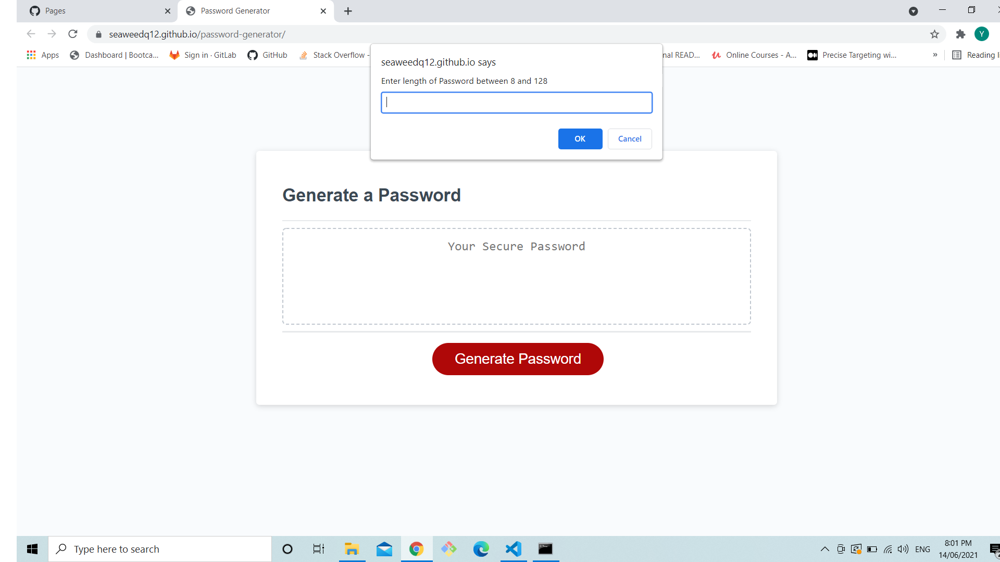
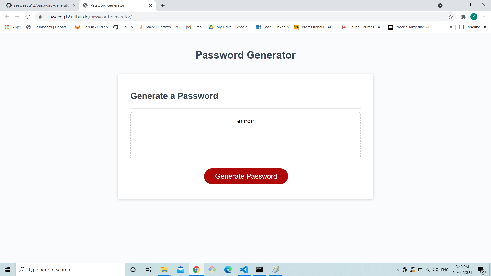
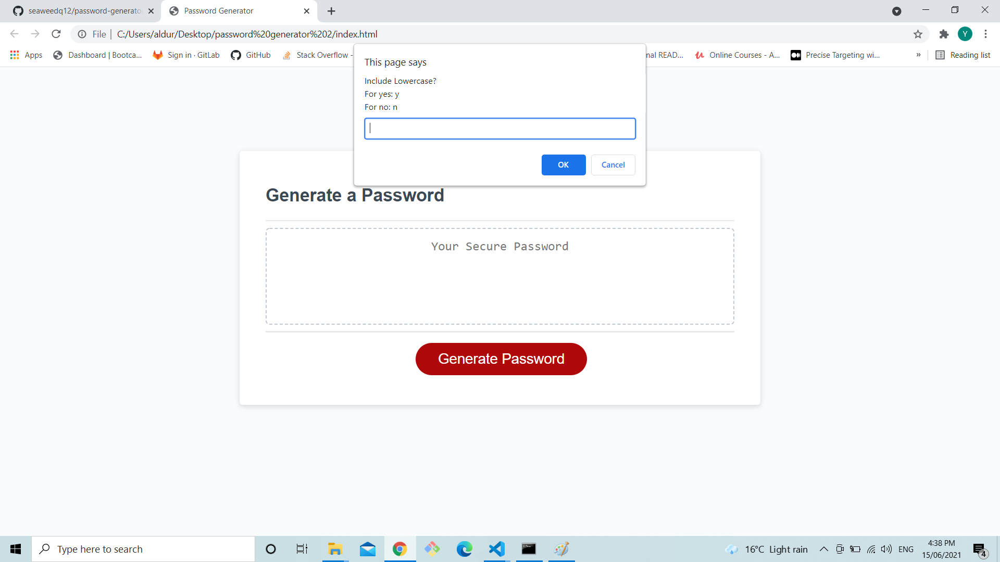
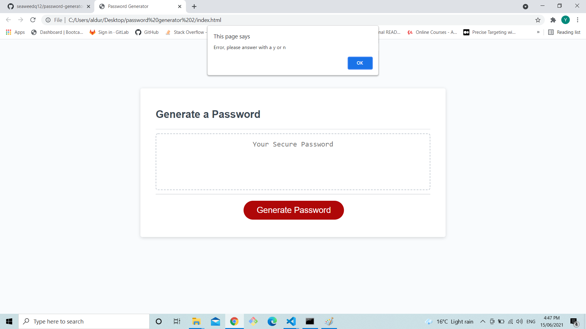
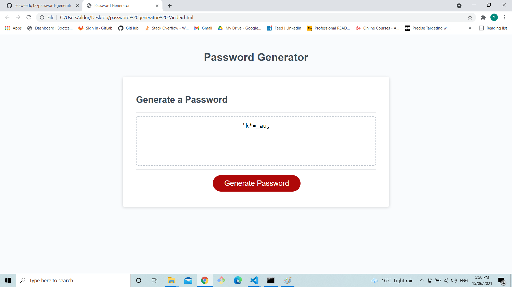
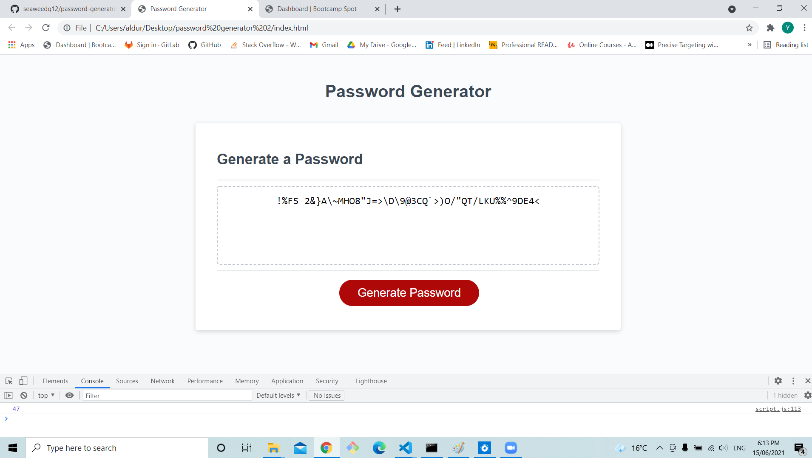
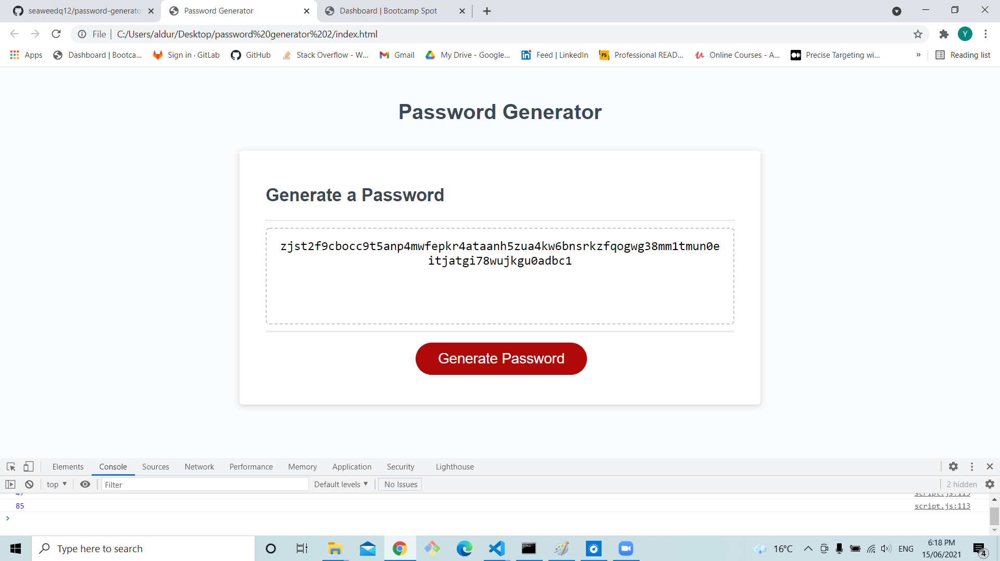
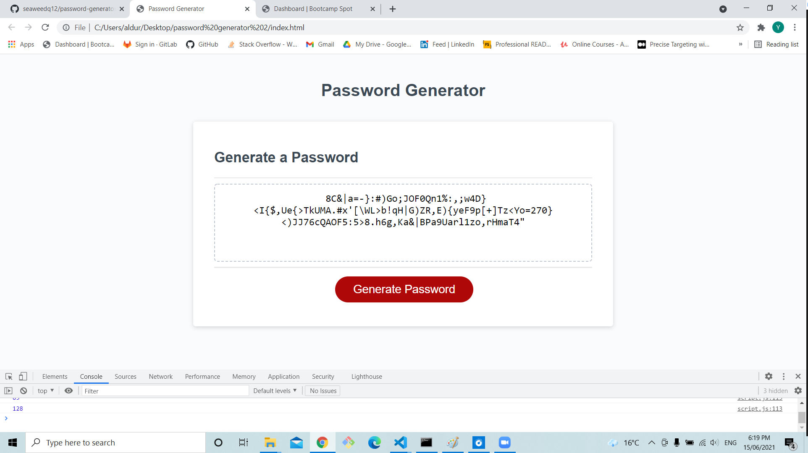

# Password Generator Remade

## task

In the homework a **prompt** had to be used when choosing the type of characters for the password as written in the user story, but in the first work **confirm** was used instead of the **prompt**   

## Work

1. Firstly when the generate button is pressed the user is prompt to a input in which the user is ask to enter the length of the password between 8 and 128 characters.

If the user cancels or places a incorrect in put the generator will return a Error message

2. In the first work after the user inputs a correct number four confirms will pop up. But in the remade code four prompt about the types character in which the user will select with a "y" for yes and "n" for no.

But if the user enters  any another input other then "y" or "n" and alert will pop up saying "Error, please answer with a y or n" and prompt the user again. This will repeat until the user inputs a "y" or "n".
 

4. In this version the user cancel anytime to restart the process. when cancelled a mesaage will pop up
 

5. when the user answers all the prompt a password matching the user in put will be shown

**Example 1** - 8 letters with lowercase and special letters

**Example 2** - 47 letters with uppercase, numbers and special letters

I did a console.log on the result.length to length input is correct 

**Example 3** - 85 letters with lowercase and numbers

I did a console.log on the result.length to length input is correct 

**Example 4** - 128 letter with all types

I did a console.log on the result.length to length input is correct 

